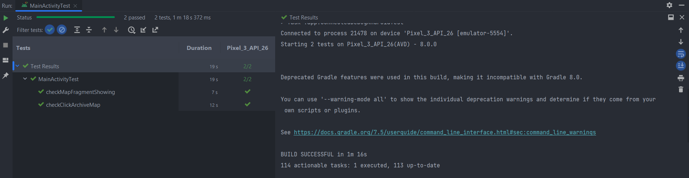
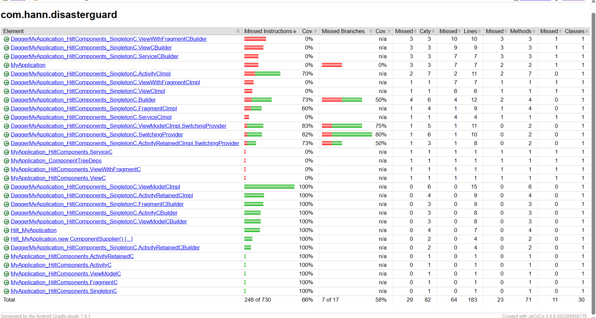
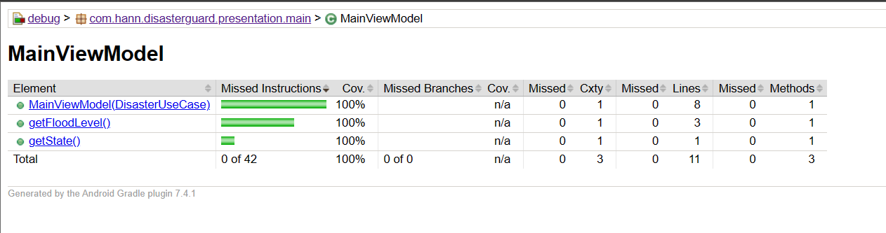
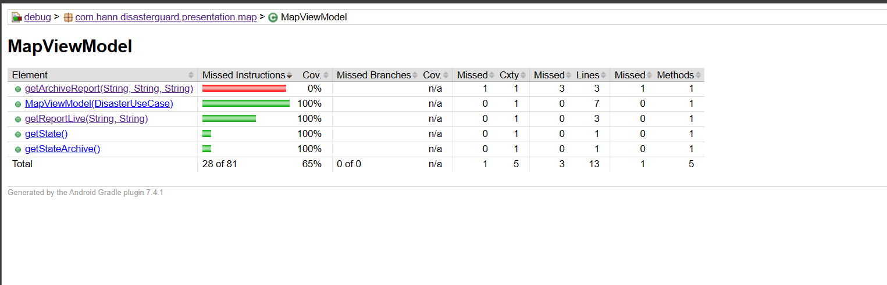

<h1 align="center">Final Project(DisasterGuard)</h1>

  

  
DisasterGuard demonstrates modern Android development with Retrofit, Koin, Coroutines, Flow, Jetpack (Room, ViewModel), and Material Design based on MVVM architecture.

 

## App Screenshots

| Mode  | Screenshots                                                                                | 
|-------|----------------------------------------------------------------------------------------|
| <b>Light</b> | |
| <b>Dark</b>  |   |

## Tech stack & Open-source libraries
- Minimum SDK level 24
- [Kotlin](https://kotlinlang.org/) based, [Coroutines](https://github.com/Kotlin/kotlinx.coroutines) + [Flow](https://kotlin.github.io/kotlinx.coroutines/kotlinx-coroutines-core/kotlinx.coroutines.flow/) for asynchronous.
- Jetpack
  - Lifecycle: Observe Android lifecycles and handle UI states upon the lifecycle changes.
  - ViewModel: Manages UI-related data holder and lifecycle aware. Allows data to survive configuration changes such as screen rotations.
  - DataBinding: Binds UI components in your layouts to data sources in your app using a declarative format rather than programmatically.
  - Room: Constructs Database by providing an abstraction layer over SQLite to allow fluent database access.
  - [Hilt](https://dagger.dev/hilt/): for dependency injection.
- Architecture
  - MVVM Architecture (View - DataBinding - ViewModel - Model)
  - Repository Pattern
- [Retrofit2 & OkHttp3](https://github.com/square/retrofit): Construct the REST APIs and paging network data.
- [Material-Components](https://github.com/material-components/material-components-android): Material design components for building ripple animation, and CardView.
- [Glide](https://github.com/bumptech/glide), [GlidePalette](https://github.com/florent37/GlidePalette): Loading images from network.
- [Android KTX](https://developer.android.com/kotlin/ktx) A collection of Kotlin extensions designed to streamline Android development using Kotlin, enhancing code conciseness, adhering to idiomatic practices, and providing a more enjoyable programming experience.
- [AndroidX AppCompat](https://developer.android.com/jetpack/androidx/releases/appcompat) A compatibility library that ensures older versions of the Android platform can leverage newer features through backward compatibility support.
- [AndroidX Preference](https://developer.android.com/jetpack/androidx/releases/preference?hl=id) A utility library that enables seamless management of application preferences through a user-friendly and contemporary programming interface.
- [Lottie](https://airbnb.io/lottie/#/) A cross-platform library (Android, iOS, and web) that parses JSON-exported Adobe After Effects animations, enabling native rendering of these animations on mobile and web environments.
- [ViewBinding](https://developer.android.com/topic/libraries/view-binding) Automatically creates a binding class for every XML layout file within the module, simplifying the process of writing code that interacts with views.
- [WorkManager](https://developer.android.com/topic/libraries/architecture/workmanager) Plan tasks that can be delayed and executed asynchronously.
- [SqlChipper](https://www.zetetic.net/sqlcipher/sqlcipher-for-android/) provides encrypted database functionality, ensuring secure storage and retrieval of sensitive data within Android applications.
- [Jacoco](https://www.eclemma.org/jacoco/) Jacoco for Android is a code coverage tool that helps measure and analyze the extent to which your Android application's source code is executed during testing, facilitating comprehensive test evaluation.

## Purpose

Contained within this repository is the source code for the Disaster App, representing the final project submission for the Generasi GIGIH 3.0 initiative. This application is crafted with the intention of furnishing data concerning disasters and their respective positions on a map. Moreover, it incorporates a range of functionalities that enable users to refine and visualize the disaster-related information.

## Features

* Display disasters according to a specific time period.
* Indicate the positions of disasters on the map.
* Enumerate disasters with filtering choices (flood, earthquake, fire, haze, wind, volcano).
* Filter disasters based on the area.
* Get notification alerts contingent on water level conditions.
* Provide compatibility for both light and dark visual themes.
* Incorporate a loading animation capability.

## Open API

DisasterGuard using the [PetaBencana]([https://docs.petabencana.id/](https://docs.petabencana.id/)) for constructing RESTful API. 
DisasterGuard provides a RESTful API interface to highly detailed objects built from thousands of lines of data related to Disaster.

## Architecture
**DisasterGuard** project is built upon the foundational principles of the MVVM (Model-View-ViewModel) architecture and incorporates the Repository pattern as a structural framework. This architectural design aligns closely with Google's official recommendations for building robust and maintainable Android applications, which follows the [Google's official architecture guidance](https://developer.android.com/topic/architecture).

The overall architecture of **DisasterGuard** is composed of two layers; the UI layer and the data layer. Each layer has dedicated components and they have each different responsibilities, as defined below:

**DisasterGuard** was built with [Guide to app architecture](https://developer.android.com/topic/architecture), so it would be a great sample to show how the architecture works in real-world projects.

### UI Layer

The UI layer consists of UI elements to configure screens that could interact with users and [ViewModel](https://developer.android.com/topic/libraries/architecture/viewmodel) that holds app states and restores data when configuration changes.
- UI elements observe the data flow via [DataBinding](https://developer.android.com/topic/libraries/data-binding), which is the most essential part of the MVVM architecture.

### Data Layer

The Data Layer encompasses repositories that encapsulate essential business logic. This logic involves tasks such as retrieving data from the local database and fetching remote data from the network. This layer is constructed with an "offline-first" approach, prioritizing operations that can be performed without an active network connection. Furthermore, the Data Layer adheres to the principle of maintaining a [single source of truth](https://en.wikipedia.org/wiki/Single_source_of_truth) principle. 

**DisasterGuard** An offline-first application is designed to execute either all or a critical subset of its core operations without requiring an active internet connection. This functionality ensures that users can access essential features even when offline, eliminating the need for constant network connectivity. Consequently, users are not obligated to stay continuously updated with network resources, leading to a reduction in their data consumption. For more in-depth insights, For further information, you can check out [Build an offline-first app](https://developer.android.com/topic/architecture/data-layer/offline-first).

## Modularization

**DisasterGuard** adopted modularization strategies below:

- **Reusability**: Modulizing reusable codes properly enable opportunities for code sharing and limits code accessibility in other modules at the same time.
- **Parallel Building**: Each module can be run in parallel and it reduces the build time.
- **Strict visibility control**: Modules restrict to expose dedicated components and access to other layers, so it prevents they're being used outside the module
- **Decentralized focusing**: Each developer team can assign their dedicated module and they can focus on their own modules.

For more information, check out the [Guide to Android app modularization](https://developer.android.com/topic/modularization).

### Encryption

Implement encryption on Room Database with SQLCipher on DisasterGuard.

# Testing Documentation
This section provides documentation for the testing of the DisasterGuard reporting application.

### UI Test/Instrumentation Test

In this test instrument there are 2 use cases:

* Displays the map correctly from the start of the application.
* Testing displays disaster based on time period.

### Unit Test

In this unit test is focused on testing all parts of the ViewModel and some independent functions:

## Download DisasterGuard App

You can access the application by downloading it through the provided link:
<a href="https://drive.google.com/file/d/1QAo4xRmdhcSeBdtH9oXp5Y2KScHMveYb/view?usp=sharing">Click here.</a>

